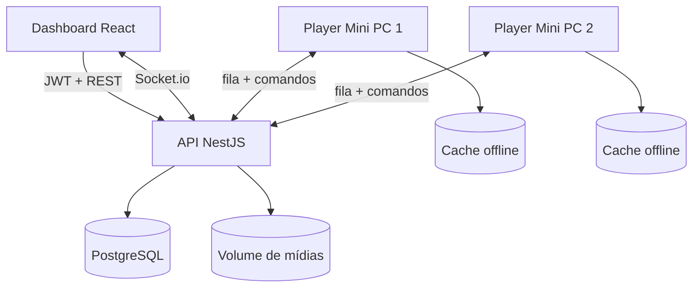

# Corporate Signage — TV Corporativa on-premise

Sistema completo para administrar o conteúdo de vários Mini PCs conectados a TVs. O **Dashboard Admin** escolhe o que cada dispositivo exibe; o **Player** de cada Mini PC somente sincroniza, armazena e reproduz o conteúdo.

## Arquitetura



- `apps/api`: NestJS, Prisma, PostgreSQL, JWT, Swagger, upload, thumbnails e streaming com `Range`.
- `apps/dashboard`: React/Vite, Tailwind, componentes no padrão shadcn/ui, Chart.js e drag-and-drop.
- `apps/player`: player React leve, Service Worker, Cache Storage, polling e Socket.io.
- `deploy`: inicialização automática em modo kiosk no Windows e Linux.

O navegador não pode ler MAC Address por segurança. Cada instalação gera um `hardwareId` persistente e recebe um token aleatório de 256 bits. O banco guarda somente o SHA-256 do token.

O gerador de `hardwareId` possui fallback compatível com acesso por IP em HTTP e navegadores kiosk antigos; ele não depende exclusivamente de `crypto.randomUUID()`.

## Estrutura de pastas

```text
corporate-signage/
├── apps/
│   ├── api/
│   │   ├── prisma/{schema.prisma,migrations/,seed.ts}
│   │   └── src/{auth,dashboard,device,media,player,playlist,realtime,schedule,widget}/
│   ├── dashboard/src/{components,lib,pages}/
│   └── player/{public/sw.js,src/}
├── deploy/{windows,linux}/
├── media-inbox/              # pasta de entrada visível no servidor
├── docker-compose.yml
├── .env.example
└── package.json
```

## 1. Preparar o servidor

Requisitos: Linux ou Windows Server com Docker Engine/Desktop e Docker Compose v2. Reserve um IP fixo, por exemplo `192.168.1.10`.

```bash
cp .env.example .env
```

Edite `.env`:

- substitua `192.168.1.10` pelo IP/DNS real do servidor;
- gere `JWT_SECRET` com `openssl rand -base64 48`;
- use senhas diferentes em `POSTGRES_PASSWORD`, `ADMIN_PASSWORD` e `ENROLLMENT_KEY` (esta última fica como acesso de emergência/legado);
- mantenha `.env` fora do Git;
- ajuste `CORS_ORIGINS` aos endereços do dashboard e do player.

Suba os serviços:

```bash
docker compose up -d --build
docker compose exec api npm run prisma:seed
docker compose ps
```

Endereços padrão:

| Serviço | Endereço |
|---|---|
| Dashboard | `http://IP-DO-SERVIDOR:8080` |
| Player | `http://IP-DO-SERVIDOR:8081` |
| API | `http://IP-DO-SERVIDOR:3000/api` |
| Swagger/OpenAPI | `http://IP-DO-SERVIDOR:3000/docs` |

Entre no dashboard com `ADMIN_EMAIL` e `ADMIN_PASSWORD` do `.env`. O seed pode ser executado novamente com segurança.

Se a senha do administrador for esquecida, defina uma nova `ADMIN_PASSWORD` no `.env` e execute `docker compose exec api npm run prisma:seed`. A conta indicada em `ADMIN_EMAIL` será promovida a administrador e receberá essa nova senha, sem apagar nenhum outro dado.

## 2. Fluxo administrativo

1. Em **Mídias**, arraste imagens, vídeos ou PDFs para a área de envio, ou clique nela para escolher um ou vários arquivos.
2. Em **Playlists**, adicione os itens, defina a duração e arraste para ordenar.
3. Em **Programação**, selecione a TV, playlist, dias, horário e prioridade.
4. Em **Dispositivos**, acompanhe online/offline e o item em exibição.
5. Para uma comunicação urgente, selecione uma playlist no card da TV e clique em **Tocar agora**. O comando fica salvo no servidor até você clicar em **Voltar à programação**.

Ao excluir uma mídia, URL ou feed que esteja em uma playlist, o sistema remove automaticamente todas as referências, reorganiza a ordem dos itens restantes e informa quantas playlists foram atualizadas.

### Arrastar e soltar mídias

A página **Mídias** possui uma área única de arrastar e soltar, sem dropdown. Também é possível clicar nessa área para escolher um ou vários arquivos. Cada arquivo é gravado diretamente no armazenamento persistente local do servidor e aparece na biblioteca ao terminar.

Imagens aceitas incluem PNG, JPG/JPEG/JFIF, WebP, GIF, AVIF, BMP, ICO, TIFF, SVG, HEIC e HEIF. Quando possível, são normalizadas para PNG; formatos nativos do navegador podem ser preservados se a normalização não for necessária. O sistema também aceita PDF e gera automaticamente a miniatura da primeira página.

Os formatos de vídeo comuns incluem MP4, M4V, MOV, MKV, AVI, WebM, WMV, MPEG/MPG, TS/MTS/M2TS, 3GP, OGV e FLV. Todo vídeo novo é recodificado pelo FFmpeg para MP4 com H.264, AAC, `yuv420p`, tag `avc1` e `faststart`. A conversão usa CPU e pode levar alguns minutos, portanto mantenha a tela aberta até aparecer a confirmação.

### Usuários e níveis de acesso

O menu **Usuários do Painel** aparece somente para administradores. Nele é possível criar o nome, e-mail, senha e perfil de cada pessoa:

- **Administrador:** gerencia conteúdo, TVs, programação e usuários;
- **Editor:** gerencia mídias, playlists, TVs e programação, mas não usuários;
- **Somente leitura:** consulta o dashboard sem alterar dados.

O sistema não permite excluir o próprio acesso nem remover o último administrador. Senhas nunca são devolvidas pela API e ficam armazenadas apenas como hash bcrypt.

Em cada usuário existe o botão **Redefinir senha**. O administrador informa e confirma uma nova senha sem precisar excluir a conta.

Se os dados locais do navegador do Mini PC forem apagados, o Player gera um novo identificador. Ao fazer o cadastro novamente com exatamente o mesmo nome da TV, o backend reutiliza o registro existente, troca seu token e consolida registros antigos com esse nome. As programações são transferidas para o registro preservado. Também é possível remover manualmente uma duplicata pelo ícone de lixeira em **Dispositivos**.

### Usuários para ativar TVs

O menu **Acessos do Player** é separado dos usuários do painel. O administrador cria uma identificação, usuário, senha e limite de TVs. Essas credenciais servem somente para ativar Mini PCs e não permitem entrar no Dashboard.

1. Entre no Dashboard como administrador.
2. Acesse **Acessos do Player → Novo acesso para TV**.
3. Crie, por exemplo, identificação `Recepção`, usuário `tv-recepcao`, uma senha forte e limite `1`.
4. Abra o Player no Mini PC, informe o nome da TV, esse usuário e essa senha.
5. Depois da ativação, o Player recebe um token próprio e não precisa guardar a senha.

O administrador pode desativar a credencial para impedir novas ativações. Isso não interrompe TVs já cadastradas; para bloquear uma TV ativa, use **Dispositivos**. A chave `ENROLLMENT_KEY` continua disponível no formulário como modo legado/emergencial.

O botão **Redefinir senha** também está disponível em cada Acesso do Player. A nova senha será exigida apenas em ativações futuras; Players que já receberam seu token continuam funcionando.

### Diagnóstico de acesso ao Dashboard

O Dashboard normaliza automaticamente endereços sem protocolo. Assim, `192.168.1.5:3000/api` passa a ser tratado como `http://192.168.1.5:3000/api`. A tela de login mostra o endereço efetivamente utilizado e os estados **API conectada** ou **API indisponível**. O diagnóstico público também pode ser aberto em `http://IP-DO-SERVIDOR:3000/api/health`.

### Loop e controle remoto

Cada playlist possui a opção **Repetir em looping**. Quando desativada, o Player encerra ao concluir o último item. O loop também reinicia corretamente playlists que possuem somente um item.

Ao adicionar um vídeo, o modo **Automático** vem ativado: o Player aguarda o término real do MP4, seja ele de 20 segundos ou 2 horas. Para cortar a exibição antes do fim, desative **Automático** e informe os segundos manualmente. Imagens, URLs e feeds continuam usando tempo manual.

Em **Dispositivos**, o controle remoto permite reproduzir, pausar, avançar ou retroceder 10 segundos em vídeos e navegar para o item anterior/próximo. Esses controles momentâneos são entregues por WebSocket e exigem que a TV esteja online.

O botão **Tocar agora** é persistente e confiável: a ordem é salva no PostgreSQL, enviada imediatamente por WebSocket e também encontrada pelo polling REST em até 15 segundos caso o WebSocket esteja indisponível. A faixa amarela no card identifica a playlist forçada. Clique em **Voltar à programação** para liberar novamente os agendamentos normais.

### Gerador automático para JSON, RSS e Atom

O cadastro de API foi retirado da página **Mídias**. Toda fonte dinâmica agora é criada em **Widgets de dados**, evitando a duplicidade entre Feed e Widget.

1. Abra **Widgets de dados → Novo widget**.
2. Informe um nome e cole a URL de uma API JSON, RSS 2.0 ou Atom.
3. Clique em **Gerar widget automaticamente**.
4. O sistema analisa a resposta, escolhe o modelo, cria o mapeamento e mostra a porcentagem de confiança.
5. Confira a prévia, personalize as cores se quiser e clique em **Criar widget**.
6. O widget aparecerá em **Mídias** e poderá ser colocado em qualquer playlist.

Os modelos automáticos incluem **Notícias**, **Clima**, **Indicador**, **Painel de metas**, **Mercado**, **Tabela** e **Lista**. O detector reconhece coleções na raiz ou dentro de campos como `articles`, `items`, `results`, `data`, `entries`, `noticias` e `news`, inclusive com propriedades aninhadas.

Em notícias, o Player alterna automaticamente os artigos a cada 9 segundos. Quando existe imagem, ela vira o fundo do destaque; sem imagem, o layout usa a identidade visual da Somai. Título, resumo, fonte e data são adaptados conforme os campos presentes.

O mapeamento manual continua disponível em uma área avançada para APIs incomuns, mas não é necessário para as estruturas reconhecidas.

#### Tela informativa com vários cards

Em **Widgets de dados** existem dois fluxos independentes:

- **Nova tela informativa:** reúne notícias, clima, mercado e data/hora em um único conteúdo 16:9;
- **Nova API personalizada:** mantém o gerador automático de JSON, RSS e Atom e o mapeamento manual avançado.

Na tela informativa, ative ou remova módulos e arraste os cards para alterar a ordem. Também é possível configurar cidade, região do mercado, modo dos ativos, quantidade, intervalo de atualização, rotação das notícias e velocidade do ticker.

Os modos financeiros disponíveis são **Mais relevantes**, **Maiores altas**, **Maiores quedas**, **Maior volume**, **Aleatório** e **Personalizado**. Nos modos automáticos, o backend descobre os ativos pela brapi e não exige o cadastro manual de cada símbolo. Sem token, a brapi limita os testes aos ativos públicos. Para liberar a lista dinâmica completa, crie um token gratuito e configure somente no servidor:

```env
WIDGET_SECRET_BRAPI=seu-token-da-brapi
```

O Player nunca recebe esse token. Notícias, Open-Meteo e brapi são consultados pelo backend, que mantém cache pelo intervalo escolhido. A TV também guarda o último painel recebido. Se somente uma fonte falhar, os demais cards são atualizados e o último conteúdo válido do card indisponível é preservado.

O ticker duplica internamente a faixa de ativos para formar um loop horizontal contínuo. As atualizações substituem os valores em segundo plano sem recriar a animação.

O servidor consulta a fonte com timeout, limite de 2 MB, bloqueio de redirecionamentos e cache. O Player recebe apenas dados normalizados, nunca a URL secreta ou o token. Ele também mantém a última resposta no Mini PC para contingência offline.

Para uma API que exige token, não cole o segredo no Dashboard. Configure no `.env`:

```env
WIDGET_SECRET_BRAPI=seu-token-real
```

No editor, use `Authorization` em **Cabeçalho** e `WIDGET_SECRET_BRAPI` em **Variável secreta**. Se a API estiver na rede interna, autorize somente o host necessário:

```env
WIDGET_PRIVATE_HOST_ALLOWLIST=erp.empresa.local,10.10.10.20
```

Depois de alterar `.env`, execute `docker compose up -d --build api dashboard player`.

#### Se o Player chamar `/api/media/feed/...` para um widget

Esse endereço identifica uma mídia antiga cadastrada em **Mídias → Notícias/API/RSS**. APIs de clima, cotações e indicadores devem ser recriadas em **Widgets de dados**, pois somente essa seção grava o tipo `WIDGET`, o mapeamento e o modelo visual.

1. Retire o feed antigo da playlist.
2. Exclua-o em **Mídias**.
3. Crie a fonte em **Widgets de dados**, teste a prévia e salve.
4. Adicione o novo item à playlist e salve novamente.
5. Em **Dispositivos**, clique em **Tocar agora** ou **Sincronizar**.

O endereço correto na aba Network será semelhante a `/api/widgets/ID/data`. A versão atual mostra na própria TV a mensagem devolvida pela API, em vez de permanecer preta, e tenta novamente a cada 60 segundos.

Uma regra de maior prioridade vence quando duas programações coincidem. O fuso horário é o do container; configure `TZ=America/Sao_Paulo` no serviço `api` se o host não usar o fuso desejado.

## 3. Configurar cada Mini PC

### Windows 10/11 com Edge

1. Acesse `http://IP-DO-SERVIDOR:8081` uma vez.
2. Informe um nome único, como `TV Recepção`, e o usuário/senha criado em **Acessos do Player**.
3. Confirme no dashboard que o dispositivo apareceu.
4. Abra PowerShell como o usuário que iniciará automaticamente e execute:

```powershell
Set-ExecutionPolicy -Scope Process Bypass
.\deploy\windows\install-kiosk.ps1 -PlayerUrl "http://IP-DO-SERVIDOR:8081"
```

5. Configure o Windows para login automático do usuário kiosk, desative suspensão de energia e reinicie.

O script cria um inicializador na pasta `Startup`; após oito segundos o Edge abre em tela cheia. Para sair durante manutenção use `Alt+F4`.

O inicializador usa a política de autoplay do modo kiosk para reproduzir vídeo **com áudio** sem exigir clique. O Player inicia com o som ligado e volume interno em 100%; o volume final continua sendo controlado pelo Windows e pela TV. Pressione `M` para alternar entre som ligado e mudo. Se o Player for aberto em uma aba comum e o navegador bloquear o primeiro autoplay sonoro, clique uma vez em **Ativar áudio**.

### Linux com Chromium

Copie `deploy/linux/signage-kiosk.desktop` para `~/.config/autostart/`, substitua `SERVIDOR` pelo IP/DNS e habilite login automático. Também desative screen saver e suspensão.

### Fire TV Stick / Android TV

O módulo `apps/fire-tv-player` transforma o mesmo Player em um aplicativo instalável para TV. Ele abre em tela cheia, mantém a tela ligada, aceita o controle remoto e tenta reabrir após o boot. Antes de compilar, edite `PLAYER_URL` em `apps/fire-tv-player/app/build.gradle` com o IP do servidor.

Depois de instalado, pressione **Menu (☰)** ou segure **Voltar** no controle para configurar o endereço do Player, endereço da API e o nome/local da TV. A configuração fica salva no Fire TV e permite alternar entre servidor local e servidor publicado na internet sem gerar outro APK.

A versão Android 1.2 configura o WebView para reprodução de mídia sem gesto e associa os botões de volume ao canal de mídia. Confirme também que o Fire TV e a TV não estão no mudo; o áudio AAC já é gerado durante o upload pelo servidor.

Para testar sem comprar o aparelho, use um dispositivo virtual **Android TV (1080p), API 35** no Android Studio. Abra `apps/fire-tv-player` como projeto, execute no emulador e faça a ativação com um usuário de **Acessos do Player**. O APK de teste é gerado por **Build > Build App Bundles or APKs > Build APK(s)**. As instruções completas estão em `apps/fire-tv-player/README.md`.

O emulador valida o aplicativo e a reprodução, mas não reproduz exatamente o launcher nem os bloqueios de inicialização automática do Fire OS. Para a instalação definitiva, alimente o Stick pela tomada e habilite HDMI-CEC/Anynet+ na TV Samsung.

## Offline e sincronização

O player consulta a fila a cada 15 segundos e recebe comandos instantâneos pelo Socket.io. Uma fila nova começa a tocar imediatamente, enquanto os arquivos são armazenados em segundo plano. Em HTTPS/localhost ele prefere Cache Storage; em um IP interno aberto por HTTP, onde `window.caches` pode não existir, usa IndexedDB. Se nenhuma das duas APIs estiver disponível, reproduz por streaming direto sem interromper o Player. Se a API cair, continua a última playlist que tiver sido armazenada. URLs/iframes dependem do site externo e podem não funcionar offline ou podem bloquear incorporação por `X-Frame-Options`/CSP.

Todo vídeo novo é recodificado para MP4 com H.264/AAC pelo servidor. Assim, HEVC/H.265 e outros formatos decodificáveis pelo FFmpeg não precisam ser convertidos manualmente antes do upload. O Player só cria a tag `<video>` depois de receber uma URL válida e diferencia erros de rede, fonte ausente e decodificação, evitando a antiga mensagem falsa de codec.

O Player baixa a mídia atual antes de iniciar, evita downloads simultâneos do mesmo arquivo e aquece o restante da playlist em segundo plano. Em playlist com um único vídeo no modo **Automático + Loop**, o mesmo elemento de vídeo permanece carregado e reinicia pelo decodificador, eliminando a troca de tela entre uma repetição e outra. Nas transições entre itens diferentes, o quadro anterior permanece visível até a próxima mídia local estar pronta.

## Publicar na internet

Para publicar a demonstração no Railway, siga primeiro o guia específico [RAILWAY.md](RAILWAY.md). O Railway recebe este monorepo pelo GitHub e cria API, Dashboard, Player e PostgreSQL como serviços separados; ele não executa este `docker-compose.yml` diretamente.

Para acesso externo, prefira três endereços HTTPS atrás de Nginx, Traefik ou Cloudflare Tunnel:

```text
https://painel.empresa.com.br  -> dashboard:80
https://player.empresa.com.br  -> player:80
https://api.empresa.com.br     -> api:3000 (inclui Socket.io)
```

No `.env` usado antes do build:

```env
PUBLIC_API_URL=https://api.empresa.com.br
VITE_API_URL=https://api.empresa.com.br/api
VITE_SOCKET_URL=https://api.empresa.com.br
CORS_ORIGINS=https://painel.empresa.com.br,https://player.empresa.com.br
```

Reconstrua `api`, `dashboard` e `player`. No aplicativo da TV, informe `https://player.empresa.com.br` no campo Player e `https://api.empresa.com.br/api` no campo API. Não encaminhe PostgreSQL nem a porta `5432` para a internet.

Vídeos grandes consomem a cota de armazenamento do navegador. Nos Mini PCs, mantenha espaço livre e use políticas do Edge/Chromium que não limpem dados do site ao fechar.

## Endpoints principais

| Método e rota | Uso | Autorização |
|---|---|---|
| `POST /api/auth/login` | Login do dashboard | Pública |
| `GET /api/health` | Diagnóstico da API e banco | Pública |
| `GET/POST/PATCH/DELETE /api/users` | Criar e administrar acessos | JWT Administrador |
| `GET/POST/PATCH/DELETE /api/player-access` | Usuários usados para ativar TVs | JWT Administrador |
| `GET/POST/PATCH/DELETE /api/media` | Biblioteca e upload | JWT |
| `POST /api/media/feed` | Compatibilidade com feeds antigos; oculto no Dashboard | JWT |
| `GET /api/media/inbox` | Integração legada: listar pasta de entrada | JWT |
| `POST /api/media/inbox/import` | Integração legada: importar pasta de entrada | JWT |
| `GET /api/media/feed/:id` | Notícias normalizadas e em cache | URL da fila |
| `GET/POST/PATCH/DELETE /api/widgets` | Construtor e gestão dos widgets JSON | JWT |
| `POST /api/widgets/analyze` | Detectar modelo e campos de JSON/RSS automaticamente | JWT |
| `POST /api/widgets/preview` | Testar fonte e produzir prévia | JWT |
| `GET /api/widgets/:id/data` | Dados seguros e normalizados para a TV | URL da fila |
| `GET/POST/PATCH/DELETE /api/playlists` | Playlists e ordenação | JWT |
| `GET/POST/PATCH/DELETE /api/schedules` | Programação | JWT |
| `GET/PATCH/DELETE /api/devices` | Dispositivos | JWT |
| `POST /api/devices/:id/control` | Play/pause/seek/anterior/próximo | JWT + WebSocket |
| `POST /api/devices/:id/emergency/:playlistId` | Tocar playlist agora, com fallback persistente | JWT |
| `POST /api/devices/:id/emergency/clear` | Voltar aos agendamentos normais | JWT |
| `POST /api/player/register` | Ativar Mini PC | Usuário/senha do Player ou `X-Enrollment-Key` legado |
| `GET /api/player/queue` | Fila ativa da TV | `X-Device-Token` |
| `POST /api/player/heartbeat` | Status/now playing | `X-Device-Token` |
| `GET /api/media/stream/:id` | Streaming com HTTP Range | URL opaca da fila |

Veja DTOs, schemas e exemplos completos no Swagger.

## Desenvolvimento local

```bash
npm install
docker compose up -d postgres
cp .env.example .env
npm run db:migrate
npm run db:seed
npm run dev:api
npm run dev:dashboard
npm run dev:player
```

## Segurança e produção

- Coloque Nginx/Traefik com HTTPS na frente dos três serviços, mesmo na rede interna.
- Restrinja portas com firewall/VLAN e exponha o dashboard apenas à rede administrativa.
- Troque a chave de provisionamento depois de cadastrar o lote de players.
- Para bloquear um Mini PC perdido, altere seu status para `BLOCKED` pela API/dashboard.
- Faça backup diário do PostgreSQL e do volume `media_uploads`.
- O upload usa gravação em disco, evitando carregar arquivos inteiros na RAM; imagens, vídeos e PDFs recebem thumbnail.
- Senhas são `bcrypt` com custo 12; tokens de usuário expiram; tokens de player nunca são salvos em texto puro no servidor.

Backup mínimo:

```bash
docker compose exec -T postgres pg_dump -U signage signage > signage.sql
docker run --rm -v corporate-signage_media_uploads:/data -v "$PWD":/backup alpine tar czf /backup/media_uploads.tgz -C /data .
```

Para atualizar, faça backup, substitua o código e execute:

```bash
docker compose build api
docker compose build dashboard
docker compose build player
docker compose up -d
```

As migrations são aplicadas automaticamente pela API. Construir uma imagem por vez também reduz picos de memória e falhas transitórias do `npm install` no Docker Desktop.

### Erro `npm ERR! EIO: i/o error, write` no Docker Desktop

Esse erro não é causado pelo aviso de nova versão do npm. Ele indica que o disco virtual do Docker falhou ao gravar, normalmente por falta de espaço, cache do BuildKit danificado ou três instalações npm executadas simultaneamente.

No PowerShell, dentro da pasta do projeto:

```powershell
Get-PSDrive C
docker system df
docker compose -p corporate-signage down
docker builder prune -af
$env:COMPOSE_PARALLEL_LIMIT="1"
.\deploy\windows\rebuild-safe.ps1
```

O `builder prune` remove somente o cache de compilação. Ele não apaga PostgreSQL nem mídias. **Não use** `docker compose down -v` e nem `docker system prune --volumes`, pois esses comandos removem os volumes persistentes.

Se o `EIO` continuar:

1. Garanta pelo menos 15–20 GB livres no disco onde o Docker Desktop armazena seus dados.
2. Feche o Docker Desktop completamente.
3. Execute `wsl --shutdown` no PowerShell.
4. Abra o Docker Desktop, espere aparecer **Engine running** e rode novamente `rebuild-safe.ps1`.

Os Dockerfiles usam lockfiles por aplicação, `npm ci`, cache compartilhado com bloqueio de escrita e menor concorrência de downloads. A `.dockerignore` também impede que `node_modules`, APKs/builds, mídias e ZIPs sejam enviados ao BuildKit.
